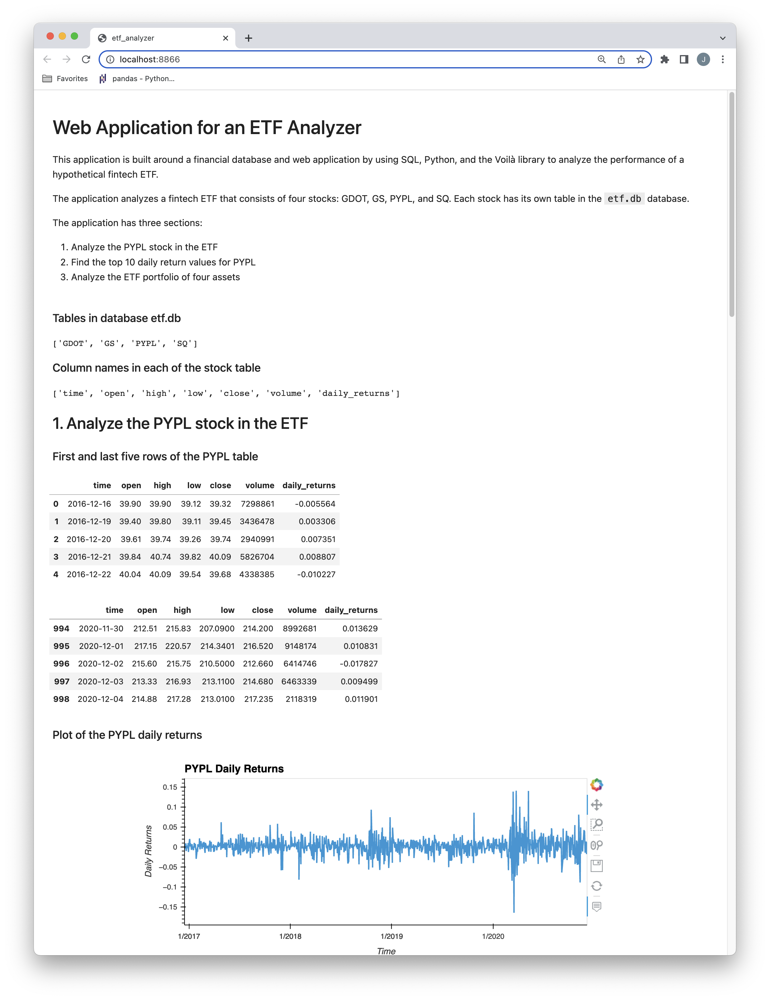
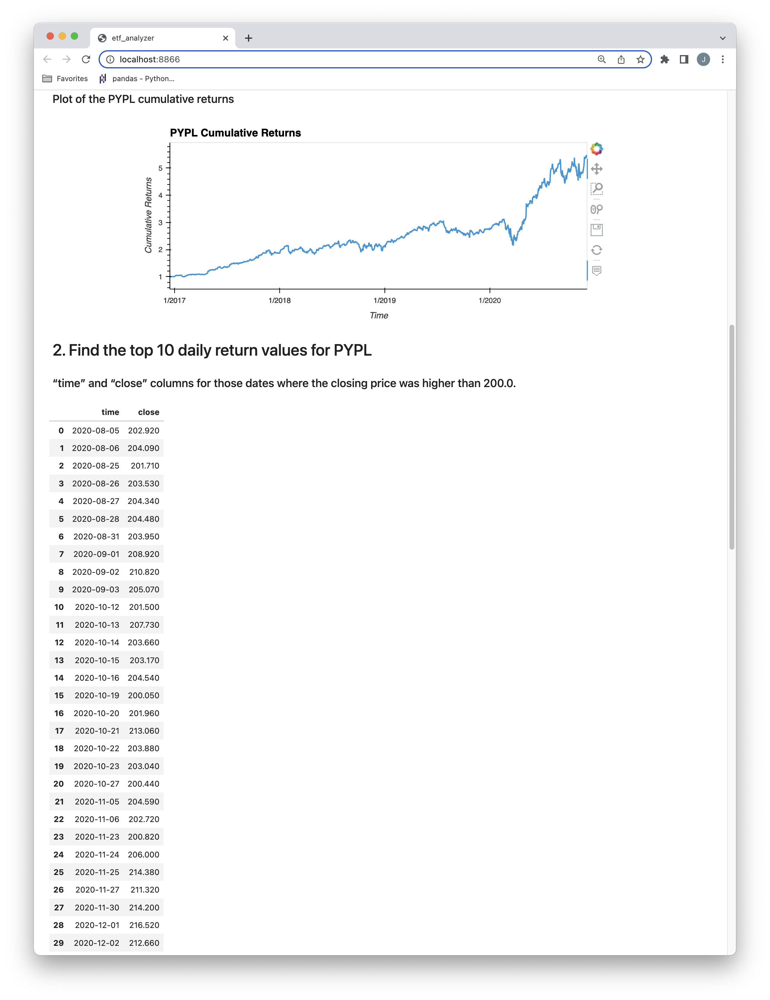
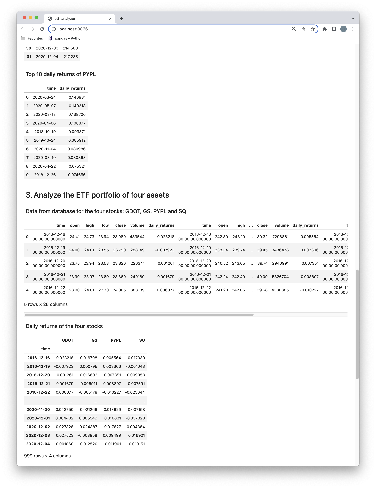
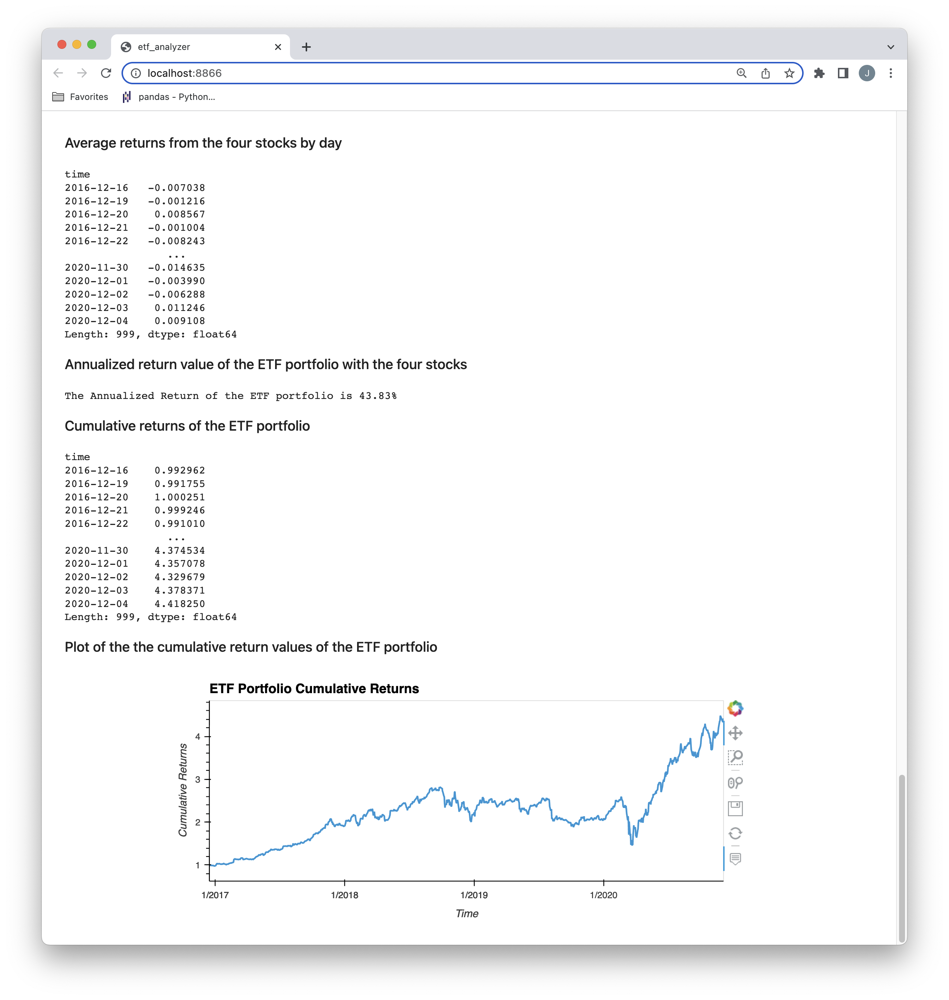

# ETF_Analayzer

This application is built around a financial database using SQL, Python, and the Voilà library to analyze the performance of a hypothetical fintech ETF.

The ETF consists of four stocks: GDOT, GS, PYPL, and SQ. Each stock has its own table in the `etf.db` database.

The application has three sections:

1. Analyze the PYPL stock in the ETF
2. Find the top 10 daily return values for PYPL
3. Analyze the ETF portfolio of four assets

The application can be viewed as a web page using the Voilà library

---

## Technologies

This application is written for use with Jupyter Lab. It uses the following packages/modules:

* [Pandas](https://github.com/pandas-dev/pandas)
* [hvPlot](https://hvplot.holoviz.org)
* [SQLAlchemy](https://www.sqlalchemy.org/)
* [Voilà](https://pypi.org/project/voila/)

---

## Usage

In Windows GitBash or Mac Terminal app, enter "Jupyter Lab". Then open and run "etf_analyzer.ipynb". 

The etf.db file in the same directory as the application.

To view the application in a web page, use a new Windows GitBash or Mac Terminal app window, navigate to the application directory and enter "Voila etf_analyzer.ipynb".

The images below shows the webpage that will be displayed with the Voilà command.

---

## Contributors

This application is written by James Tan, with code snippets provided UBC Extension.

---

## License

MIT.